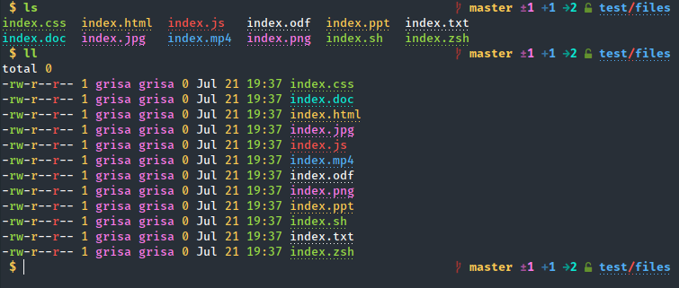

# ls
Zsh plugin for ls. It improves the output of `ls`, and adds the following aliases:

* `l` - show files
* `ls` - show files
* `la` - show all files
* `ll` - show files line by line



This plugin supports [exa](https://github.com/ogham/exa), if installed and no `ZSH_LS_PREFER_LS` is defined as environment variable then:

* `l` - show files, without git ignored
* `ls` - show files
* `la` - show all files
* `ll` - show files line by line

> You can disable git integration in exa using this:


```sh
export ZSH_LS_DISABLE_GIT=true
```


#### Note
For a better view, use a theme for `dircolors`, for example [dircolors-material](https://github.com/zpm-zsh/dircolors-material)

# How to install

## [oh-my-zsh](http://github.com/robbyrussell/oh-my-zsh)

* Download the script or clone this repository in [oh-my-zsh](http://github.com/robbyrussell/oh-my-zsh) plugins directory:

```sh
cd ~/.oh-my-zsh/custom/plugins
git clone https://github.com/zpm-zsh/ls.git
```

* Activate the plugin in `~/.zshrc`:

```sh
plugins=( [plugins...] ls [plugins...])
```

* Restart shell

## [zpm](https://github.com/zpm-zsh/zpm)

Add the following to your .zshrc file somewhere after you source zpm.

```sh
zpm load zpm-zsh/ls
```

## [antigen](https://github.com/zsh-users/antigen)

Add `antigen bundle zpm-zsh/ls` to your .zshrc where you're adding your other plugins. Antigen will clone the plugin for you and add it to your antigen setup the next time you start a new shell.

## [prezto](https://github.com/sorin-ionescu/prezto)

For most people the easiest way to use zshmarks with [prezto](https://github.com/sorin-ionescu/prezto) is to manually clone the zshmarks repo to a directory of your choice (e.g. /usr/local or ~/bin) and symlink the zshmarks folder into your zpretzo/modules folder:

```sh
ln -s ~/bin/ls ~/.zprezto/modules/ls
```

Alternatively, you can add the zshmarks repository as a submodule to your prezto repo by manually editing the '.gitmodules' file:

```ini
[submodule "modules/ls"]
        path = modules/ls
        url = https://github.com/zpm-zsh/ls.git
```

Then make sure you activate the plugin in your .zpreztorc file:

```sh
zstyle ':prezto:load' pmodule \
ls \
...
```

## [zplug](https://github.com/zplug/zplug)

Add the following to your .zshrc file somewhere after you source zplug.

```sh
zplug "zpm-zsh/ls"
```
